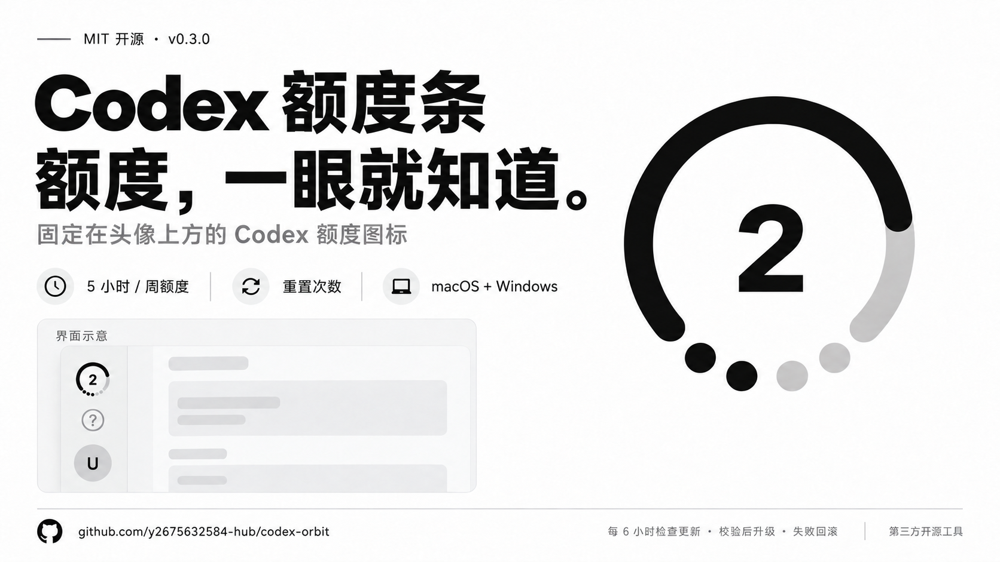
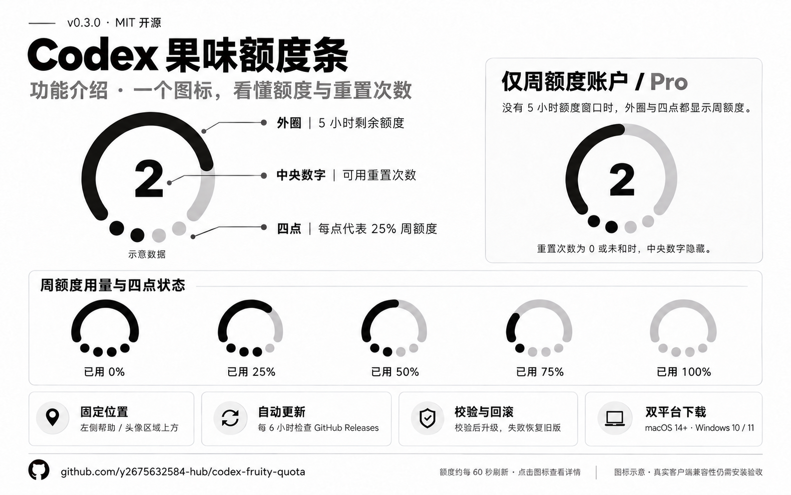

# Codex 果味额度条



[macOS 下载](https://github.com/y2675632584-hub/codex-fruity-quota/releases/tag/v0.4.1-macos) · [Windows 下载](https://github.com/y2675632584-hub/codex-fruity-quota/releases/tag/v0.4.1-windows)

「果味」指苹果风格：白底、黑灰图标与简洁的状态显示。

一个固定在 Codex 桌面端左侧导航栏、帮助／头像区域上方的剩余额度图标。它在侧栏布局中占位，窗口移动和侧栏重绘后会恢复位置。

- **外圈**：优先显示 5 小时剩余额度；账户没有该额度窗口（如仅周额度的 Pro）时改为周额度，外圈与四点都使用周额度。余量越少，圆弧越短。
- **下方四点**：本周额度，每用完 25% 一个点变灰。已用 0 / 25 / 50 / 75 / 100% 时分别亮 4 / 3 / 2 / 1 / 0 个点。
- **中央数字**：账户实际可用重置次数；0 次或数据未知时隐藏。点击只查看详情，不会使用重置次数。
- **配色**：点击头像上方的额度图标，在详情面板的「图标配色」中选择经典黑、晴空蓝、雾紫、电量绿、蜜桃粉或暖琥珀。立即生效，并在当前客户端本地保存；其他窗口同步选择。
- **低额度提醒**：仅电量绿在外圈剩余 ≤30% 时变红；周额度圆点和重置数字保持绿色，其他配色不变。无 5 小时额度时按周额度判断。
- 数据约每 60 秒读取；未知额度用空心点表示，过期数据变淡，不冒充满额或实时状态。



[下载宣传图](docs/images/promo.png) · [下载功能介绍图](docs/images/features.png) · [图片说明与生成提示词](docs/images/README.md)

复用 [jaykinhoo9/codex-usage-badge](https://github.com/jaykinhoo9/codex-usage-badge) 的 MIT 代码：本机连接、账户额度读取和 macOS 启动助手；按同一定位方式重新实现图标。固定来源提交与校验值见 [SOURCE.json](third_party/codex-usage-badge/SOURCE.json)，许可与改造范围见 [THIRD_PARTY_NOTICES.md](THIRD_PARTY_NOTICES.md)。继续复用参考项目的更新校验和 Windows 安装／启动方案；没有加入文件夹配色或 Token 统计。

这是第三方运行时界面接入，不是官方插件。它不修改 Codex 应用文件或签名；Codex 更新后如果导航栏结构改变，可能需要调整。找不到目标栏时隐藏图标；检测到原版用量条时也会隐藏，避免重复占位。请先停止原版用量条，再安装此版本。

## 改名说明

项目已更名为 **Codex 果味额度条**，仓库为 `codex-fruity-quota`。原有安装目录、服务名和 ZIP 文件名保留 `CodexOrbit`，避免重复安装。

**0.3.0 ZIP 仍携带旧更新源**，旧版更新器会拒绝改名后的下载地址。请手动下载 **0.4.1** 并重新安装一次，之后使用本项目的新仓库自动更新。0.4.1 新增六种配色、选择保存和仅绿色的低额度提醒。

## 安装（macOS）

要求 macOS 14+，Intel 或 Apple Silicon；已安装并登录带 Codex CLI 的 Codex 桌面应用；Node.js 24+。安装入口优先使用客户端随附的 Node，没有时需自行安装 Node 24。

1. 解压 `CodexOrbit-macOS-0.4.1.zip`，保持文件夹完整，双击 **安装.command**。
2. 保存当前工作，用 **⌘Q** 完全退出 Codex，再从原来的图标打开，等待约 5–10 秒。
3. 图标应出现在左侧栏帮助／头像区域上方；点击查看两种额度与重置时间，或在「图标配色」里切换颜色。点击面板外、关闭按钮或按 Esc 收起。

启动助手只尝试重新打开刚启动、在前台且尚未接收到输入的客户端；已有运行中的窗口不会因安装被退出。如果首次启动时操作太快而跳过接入，完全退出后双击 **打开 Codex.command**。它会直接带接入参数启动，不会强制结束现有聊天。

程序使用 `127.0.0.1:39222` 本机调试连接。能够访问该端口的本机程序可能控制客户端；不要将端口转发到网络。退出 Codex并普通重开可关闭调试连接。额度读取沿用 Codex 现有登录；不解析密码、Cookie、API Key，不采集聊天内容，也不上传额度。启动助手读取应用启动、前台与输入时序状态，不记录输入内容。自动更新默认开启，读取本项目自己的 GitHub Releases。

## 自动更新

macOS 后台每 **6 小时**检查本项目 GitHub Releases，启动时也会检查一次。只选择已发布、版本更高、来源与平台匹配的安装包。macOS 要求 GitHub 资产 SHA-256 摘要，再校验包内清单、每个文件、版本和路径；校验失败不会进入安装。

后台先准备完整新版，再替换本工具目录并确认新版额度后台和启动助手就绪。安装或启动确认失败时恢复旧目录与启动配置；成功也保留可恢复的旧版备份。更新过程不退出已有 Codex 会话。网络或校验失败保留旧版，下一次检查周期重试。

- `立即更新.command`：立即检查并升级。
- `更新诊断.command`：查看版本、更新开关与结果。
- `开启自动更新.command` / `关闭自动更新.command`：管理更新开关。

尚未发布的新版本不会触发升级。校验使用 GitHub Release 来源与 SHA-256，并非独立签名认证；发布账户与仓库权限仍属于更新信任边界。

## Windows 下载与使用

完整解压 `CodexOrbit-Windows-0.4.1.zip`，双击 `Install.cmd`；保存工作并从托盘／菜单完全退出 Codex，再从原图标重开。支持 Windows 10 / 11，当前用户安装，无需管理员权限，自动查找 Store／普通桌面客户端与 Node 24。

Windows 同样每 6 小时检查自己的 Windows Releases，校验下载和包内文件，安装失败回滚。`Launch.cmd`、`Status.cmd`、`Update.cmd`、`Uninstall.cmd` 提供手动启动、诊断、更新、卸载。[详细说明](docs/windows.md)。当前 macOS 开发环境无法实机验证 Windows；Windows 原生检查 CI 已通过；真实客户端兼容性仍需安装后验收。

## 诊断、停止与卸载

- **诊断.command**：查看安装、后台和本机端口状态。
- **停止.command**：停止两个后台；退出并重开 Codex 可移除当前窗口中的图标。
- **卸载.command**：停止后台，将本工具程序和启动配置移入废纸篓；不删除 Codex 账号或聊天。随后退出并重开 Codex。

程序位于 `~/Library/Application Support/CodexOrbit`，运行日志位于 `~/Library/Logs/CodexOrbit`。配置可以通过 `CODEX_ORBIT_APP` 指定客户端路径、`CODEX_ORBIT_NODE` 指定 Node 路径；自定义 `CODEX_HOME` 在安装时传入并保存到后台环境。

## 从源码构建

```sh
python3 scripts/build.py --native
node --test
python3 -m unittest discover -s tests -p 'test_*.py'
python3 scripts/build_release.py
# 仅生成 Windows 包（不需要 macOS 原生编译）
python3 scripts/build_release.py --platform Windows
```

macOS 原生构建需要 Node 24、Python 3.9+ 与 Xcode Command Line Tools；Windows 包可跨平台生成。没有 npm 依赖，也无需 npm install。原生启动助手同时编译 arm64 / x86_64，使用本地临时签名；分发包尚未经过 Apple 公证。

本地预览：双击 `Start Preview.command` 或运行 `python3 -m orbit.server --port 8765`，打开 `http://127.0.0.1:8765/`。这是模拟导航栏，用与实际接入相同的图标代码验证位置；它不向 Codex 注入内容。`/index.html` 是可复用 Web Component 的独立预览；`/colors.html` 是六种配色的演示样板。正式交互在 `/rail.html`，点击左下角图标打开配色面板。

## 验证范围

已验证账户只读接口、34 项自动测试、模拟导航栏固定占位和重绘恢复、零重置隐藏、额度用尽、侧栏隐藏和浅色外观。已生成并校验双架构 macOS 包。

**尚未验证本机真实 Codex 窗口的最终安装效果。** 当前自动操作工具禁止控制 Codex 本体，所以安装和客户端重开需使用者操作。构建成功、模拟页面成功与真实客户端安装成功是不同验证层级。详见 [VERIFICATION.md](VERIFICATION.md)。

## 开源发布

源码采用 MIT，保留原项目许可。可以将本仓库推送到自己的 GitHub 仓库，使用标签 `v0.4.1-macos` 与 `v0.4.1-windows` 分别发布，两种 ZIP 与 `dist/SHA256SUMS.txt` 附在对应 Release，让别人解压安装；更新源配置为 `y2675632584-hub/codex-fruity-quota`，发布状态见交付说明。

请不要提交本机配置、运行日志、账号数据或预览中的个人额度。`.gitignore` 已排除这些目录；打包脚本使用明确文件清单，不包含个人设置或参考截图。GitHub Actions 的测试流程覆盖 macOS 与 Windows；推送平台版本标签后，发布流程构建、测试并上传对应 ZIP 与校验清单。发版前同步修改 package.json 版本号。欢迎提交兼容性修复；报告问题时提供应用版本、系统版本和经过脱敏的日志。
